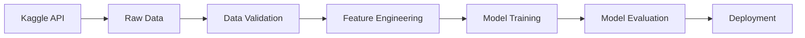

# Credit Card Customer Churn Analysis

A professional data science project analyzing credit card customer attrition patterns using machine learning and interactive Streamlit dashboards.

## Project Overview

This project analyzes credit card customer data to identify patterns and predict customer churn. The analysis follows industry-standard data science workflows, demonstrating best practices in data engineering, exploratory analysis, feature engineering, model development, and deployment.

**Dataset**: [Credit Card Customers](https://www.kaggle.com/datasets/sakshigoyal7/credit-card-customers) from Kaggle

**Key Objectives**:
- Understand customer attrition patterns and drivers
- Build predictive models for customer churn
- Deliver insights through interactive dashboards
- Demonstrate production-ready MLOps practices

## Project Structure

```
├── .github/
│   └── workflows/          # CI/CD pipelines
├── data/
│   ├── raw/               # Raw data from Kaggle
│   ├── processed/         # Cleaned and transformed data
│   └── model/             # Trained model artifacts
├── jupyter_notebooks/
│   ├── 01_extract.ipynb   # Data ingestion and validation
│   ├── 02_eda.ipynb       # [TODO] Exploratory data analysis
│   ├── 03_feature_engineering.ipynb  # [TODO] Feature creation
│   └── 04_modeling.ipynb  # [TODO] Model training and evaluation
├── src/
│   ├── data/              # [TODO] Data processing modules
│   ├── features/          # [TODO] Feature engineering
│   ├── models/            # [TODO] Model training and prediction
│   └── visualization/     # [TODO] Plotting utilities
├── app.py                 # Streamlit dashboard application
├── ingest.py             # Kaggle data download script
├── requirements.txt       # Python dependencies
├── Makefile              # Development automation
└── README.md             # Project documentation
```

## Features

- **Automated Data Ingestion**: Direct download from Kaggle API
- **Reproducible Analysis**: Jupyter notebooks with clear workflow
- **Interactive Dashboards**: Streamlit-based visualization
- **MLOps Best Practices**: Version control, testing, CI/CD
- **Production Ready**: Containerized deployment with Heroku/Streamlit Cloud

## Setup Instructions

### Prerequisites

- Python 3.12.8 or compatible version
- Kaggle API credentials (see [Kaggle API Setup](#kaggle-api-setup))
- Git for version control

### Local Development Setup

1. **Clone the repository**
   ```bash
   git clone <repository-url>
   cd Credit-Card-Customers
   ```

2. **Create and activate virtual environment**
   ```bash
   python -m venv .venv
   source .venv/bin/activate  # On Windows: .venv\Scripts\activate
   ```

3. **Install dependencies**
   ```bash
   pip install -r requirements.txt
   ```

4. **Download dataset**
   ```bash
   python ingest.py
   ```

5. **Launch Jupyter notebooks**
   ```bash
   jupyter notebook
   ```

6. **Run Streamlit dashboard** *(after model development)*
   ```bash
   streamlit run app.py
   ```

### Kaggle API Setup

1. Create a Kaggle account at [kaggle.com](https://www.kaggle.com)
2. Navigate to Account Settings → API → Create New API Token
3. Download `kaggle.json` and place it in `~/.kaggle/` directory
4. Set permissions: `chmod 600 ~/.kaggle/kaggle.json`

## Development Workflow

### Data Pipeline



### Make Commands

```bash
make install      # Install dependencies
make lint         # Run Ruff linting
make format       # Run Black code formatting
make nbstrip      # Strip notebook outputs
make pre-commit   # Run lint + format + nbstrip (recommended before commits)
make app          # Run Streamlit dashboard
make clean        # Remove caches and temp files
```

### DevOps Tools

**Code Quality**
- **Ruff**: Fast Python linter for code quality and style enforcement
- **Black**: Opinionated code formatter for consistent style across the project

**Notebook Management**
- **nbstripout**: Strips output cells and metadata from Jupyter notebooks before commit
  - Prevents binary bloat in Git repository (images, plots, execution metadata)
  - Keeps version control focused on code changes, not outputs
  - Reduces merge conflicts in collaborative environments
  - Automatically validated via GitHub Actions on every PR
- **nbdime**: Notebook-aware diffing and merging tool
  - Provides human-readable diffs of notebook structure and code
  - Integrates with Git to show semantic changes (not JSON noise)
  - Web-based diff viewer: `nbdiff-web notebook.ipynb`
  - Enable Git integration: `nbdime config-git --enable`

**CI/CD Pipeline**
- GitHub Actions workflow validates notebooks are stripped before merge
- Ensures all commits maintain clean notebook hygiene
- Run `make pre-commit` before committing to pass all checks

## Methodology

### 1. Data Ingestion (`ingest.py`)
- Automated download from Kaggle
- Schema validation and type enforcement
- Data dictionary parsing for metadata

### 2. Exploratory Data Analysis (`02_eda.ipynb`) [TODO]
- Distribution analysis
- Missing data assessment
- Correlation and feature relationships
- Customer segmentation

### 3. Feature Engineering (`03_feature_engineering.ipynb`) [TODO]
- Derived features from transaction patterns
- Encoding categorical variables
- Scaling and normalization
- Feature selection

### 4. Model Development (`04_modeling.ipynb`) [TODO]
- Baseline model establishment
- Algorithm comparison (Logistic Regression, Random Forest, XGBoost)
- Hyperparameter tuning
- Cross-validation and performance metrics
- Model interpretation (SHAP values)

### 5. Dashboard Application (`app.py`) [TODO]
- Customer overview and KPIs
- Churn prediction interface
- Feature importance visualization
- Model performance metrics
- Interactive filtering and segmentation

## Deployment

### Streamlit Cloud
1. Connect GitHub repository to Streamlit Cloud
2. Configure secrets for API keys
3. Deploy with auto-reload on commits

### Heroku (Alternative)
```bash
git push heroku main
```

**Requirements**:
- `Procfile`: Web process configuration
- `.python-version`: Python runtime specification
- Environment variables for credentials

## Technology Stack

- **Data Processing**: pandas, numpy
- **Machine Learning**: scikit-learn, xgboost
- **Visualization**: matplotlib, seaborn, plotly
- **Dashboard**: Streamlit
- **Data Source**: Kaggle API (kagglehub)
- **Version Control**: Git, GitHub
- **Deployment**: Streamlit Cloud / Heroku

## Key Metrics [TODO]

| Metric | Target | Current |
|--------|--------|---------|
| Model Accuracy | >85% | TBD |
| Precision (Churn) | >80% | TBD |
| Recall (Churn) | >75% | TBD |
| F1-Score | >0.80 | TBD |

## Roadmap

- [x] Project initialization
- [x] Data ingestion pipeline
- [ ] Exploratory data analysis
- [ ] Feature engineering
- [ ] Model training and evaluation
- [ ] Streamlit dashboard development
- [ ] CI/CD pipeline setup
- [ ] Production deployment
- [ ] Model monitoring and retraining

## Contributing

This is a pedagogical project following professional data science standards. Contributions welcome via pull requests.

## License

This project is for educational purposes.

## Acknowledgments

- Dataset: [Sakshi Goyal](https://www.kaggle.com/sakshigoyal7) via Kaggle
- Framework: Code Institute Data Analytics template
